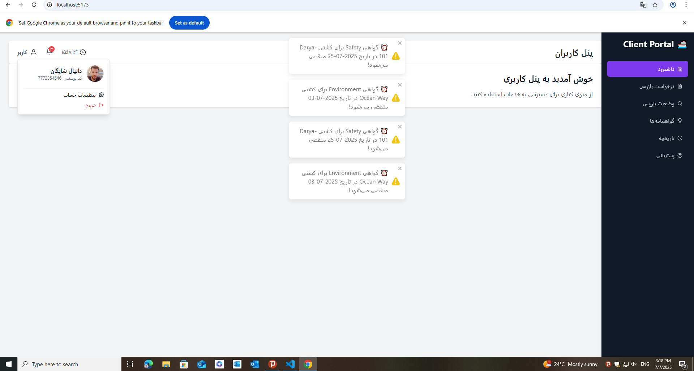
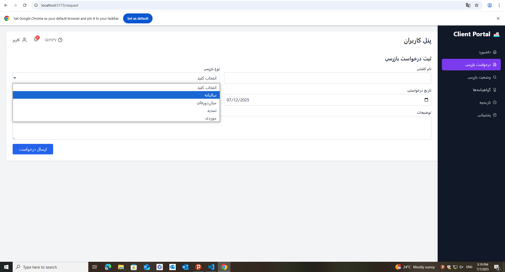
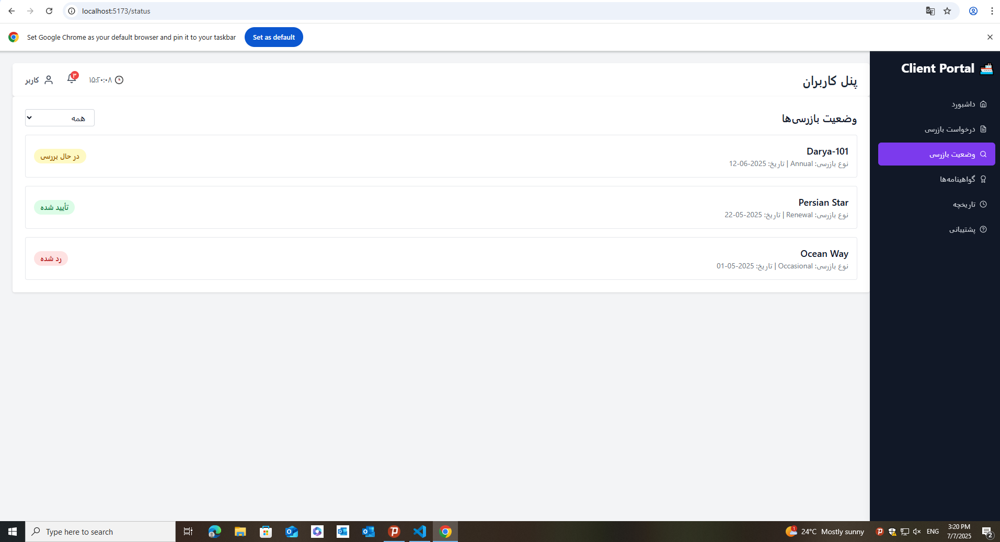
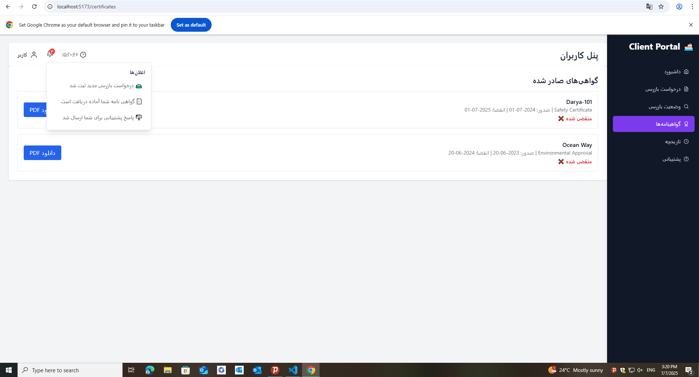

# ⚓ Client Portal for Ship Classification Companies

A responsive, RTL-enabled client portal built for ship owners and inspection agencies to manage survey requests, view certifications, and communicate with technical support.

🌐 Live Demo (optional): _Coming soon_  
📂 Built with: `React`, `TailwindCSS`, `React Router`, `Toastify`  
📅 Language: Farsi (RTL layout)  
📁 Status: ✅ MVP Complete

---

## 📸 Screenshots

| Dashboard (RTL) | Inspection Form | Survey Status |
|------------------|------------------|----------------|
|  |  |  |


| Certificates | History | Support |
|------------------|------------------|----------------|
|  |  |  |


---

## ✨ Features

- 📋 **Dashboard**: Overview with certificate expiry alerts
- 🧾 **Inspection Request**: Submit new ship inspection forms
- 🔍 **Survey Status**: Filter surveys by status (pending, approved, rejected)
- 📜 **Certificates**: View and download issued documents
- 🕘 **History**: Access inspection records
- 💬 **Support**: Live-like technical support chat UI
- 🌙 **Right-to-Left (RTL)** support for Persian users
- 📱 **Responsive UI** for desktop and tablet

---

## ⚙️ Tech Stack

| Tech | Usage |
|------|-------|
| [React](https://reactjs.org/) | UI framework |
| [Tailwind CSS](https://tailwindcss.com/) | Styling |
| [React Router](https://reactrouter.com/) | Page navigation |
| [React Toastify](https://fkhadra.github.io/react-toastify/) | Notifications |
| Vite | Fast bundler/dev server |

---

## 🚀 Getting Started

### 1. Clone the repository
```bash
git clone https://github.com/alirazi1992/Client-Portal-for-Ship-Classification-Companies.git
cd Client-Portal-for-Ship-Classification-Companies
```
### 2. Install dependencies
``` bash
npm install
```
Then open: http://localhost:5173

### 📁 Folder Structure
src/
│
├── components/       # Header, Sidebar

├── pages/            # Dashboard, SurveyStatus, etc.

├── assets/           # Optional: fonts, images

├── App.jsx           # Routes & layout

├── main.jsx          # App entry point

└── index.css         # RTL styles + Tailwind

### 🧰 Customization Ideas

  - Add login/authentication

  - Integrate with backend API

  - Convert to bilingual with i18next

  - Add charts and analytics to dashboard

### 🙌 Author
Created by Ali Razi
Inspired by real-world needs in the maritime classification industry.
